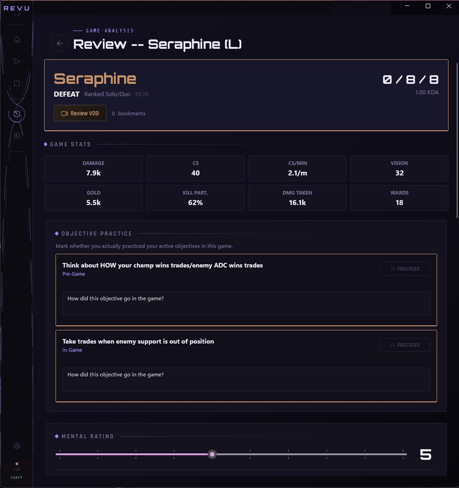

# Revu

**A Windows desktop app that reviews your League of Legends games with you.**

[](https://github.com/samif0/lol-review/releases/latest)



## What it actually does

Most League stats sites tell you *what* happened. Revu helps you ask *why*
and *what to work on next*. It detects champ select, prompts you for a
pre-game intention, captures post-game stats, and walks you through a
structured review — mistakes, what went well, focus for next game.
Objectives are journaled across the games where you practiced them.
Optional VOD recording (via [Ascent](https://ascent.gg)) auto-links so
review notes are timestamped.

## Why this isn't op.gg

- **It's a coach, not a scoreboard.** The post-game flow forces a
  2-minute reflection — tilt-check, attribution, what's within your
  control. Not a stat dashboard.
- **Your data is yours.** SQLite at `%LOCALAPPDATA%`, no cloud sync,
  no telemetry. Riot ID + region only go through our Cloudflare Worker
  proxy for Match-V5 lookups.
- **Open source.** Read the code, fork it, file a PR.

## Install

Latest **`Setup.exe`** is at
[Releases](https://github.com/samif0/lol-review/releases/latest). Run it,
launch from Start Menu. Auto-update is built in — no need to re-download.
See [revu-lol.app](https://revu-lol.app) for a walkthrough.

MIT-licensed ([LICENSE](LICENSE)). Bug reports via the
[issue templates](https://github.com/samif0/lol-review/issues/new/choose);
security issues to [SECURITY.md](SECURITY.md); contributions via
[CONTRIBUTING.md](CONTRIBUTING.md).

> *Revu isn't endorsed by Riot Games and doesn't reflect the views or
> opinions of anyone officially involved in producing or managing
> League of Legends. League of Legends and Riot Games are trademarks
> or registered trademarks of Riot Games, Inc.*

---

## Data and logs

Current user-data location:

```text
%LOCALAPPDATA%\LoLReviewData\
```

Important files:

- Database: `%LOCALAPPDATA%\LoLReviewData\revu.db`
- Config: `%LOCALAPPDATA%\LoLReviewData\config.json`
- Safety backups: `%LOCALAPPDATA%\LoLReviewData\backups\`
- Default clips folder: `%LOCALAPPDATA%\LoLReviewData\clips\`

Install-owned files:

- App binaries: `%LOCALAPPDATA%\LoLReview\current\`
- Packages / updater files: `%LOCALAPPDATA%\LoLReview\packages\`

Logs:

- Startup log: `%LOCALAPPDATA%\LoLReview\startup.log`
- Crash log: `%LOCALAPPDATA%\LoLReview\crash.log`
- Velopack log: `%LOCALAPPDATA%\LoLReview\velopack.log`

## Development

### Requirements

- Windows 10/11
- .NET 8 SDK
- Visual Studio 2022 or MSBuild Build Tools
- League of Legends client for live monitoring features

Optional runtime dependency:

- `ffmpeg.exe` in `deps\` for clip extraction

### Build from CLI

```powershell
dotnet build src\Revu.App\Revu.App.csproj -c Debug -r win-x64
```

To run from CLI after building, use `run.bat` or launch the exe directly
at `src\Revu.App\bin\x64\Debug\net8.0-windows10.0.19041.0\Revu.App.exe`.

Tests live in `src\Revu.Core.Tests\`:

```powershell
dotnet test src\Revu.Core.Tests\
```

See [docs/CODEBASE_ONBOARDING.md](docs/CODEBASE_ONBOARDING.md) for an
architecture overview and [CONTRIBUTING.md](CONTRIBUTING.md) for the
contribution flow.

## Releases

Releases are automated through `.github/workflows/release.yml`. To
publish a new version, commit to `main`, tag `v2.x.y`, and push both:

```powershell
git tag -a v2.17.0 -m "v2.17.0"
git push origin main v2.17.0
```

The workflow stamps the version, publishes for `win-x64`, includes
`ffmpeg.exe` if available, packs with `vpk`, and publishes a GitHub
Release that the in-app updater consumes.

Tag rules currently accepted: `v2.[1-9].*`, `v3.*`.

## Project structure

```text
src/
  Revu.App/        WinUI 3 desktop app, DI, views, view models, update flow
  Revu.Core/       SQLite, repositories, services, LCU integration, migrations
  Revu.Core.Tests/ xUnit, in-memory SQLite fixtures
.github/
  ISSUE_TEMPLATE/  Bug + feature templates
  workflows/       GitHub Actions release pipeline
docs/              CODEBASE_ONBOARDING, LAUNCH_READINESS, etc.
site/              Static landing site at revu-lol.app
proxy/             Cloudflare Worker that proxies Riot Match-V5
```
