# UI Redesign Handoff

**Status:** Theme foundation shipped (commit `fd68a6f`), but the page layouts still don't match the mockup. This doc is for continuing the work on a different machine.

**Design truth:** `mockups/app-mockup.html` — open in a browser and compare. The mockup has layouts and effects the current app doesn't.

## Mockup Screenshots (Target Design)

Screenshots of each page from the mockup at 1400x900. This is what the app should look like after Phase 6 is complete.

### Dashboard
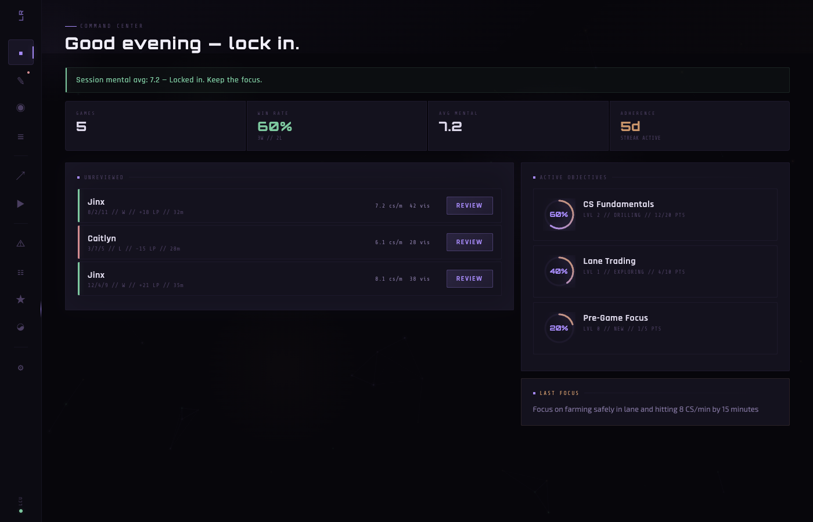

### Review
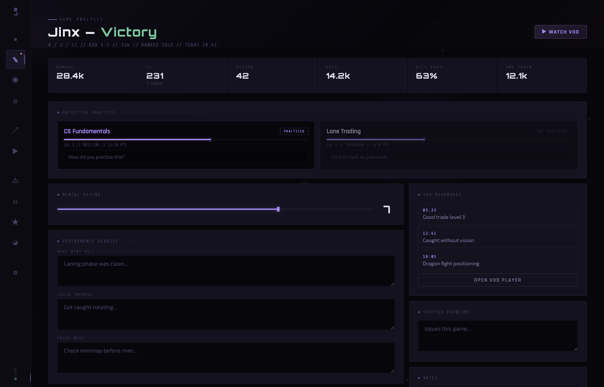

### Objectives
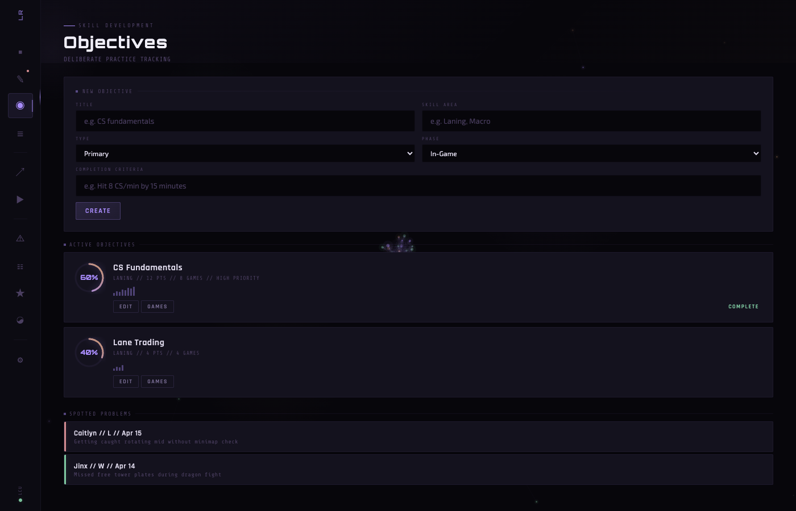

### Archive
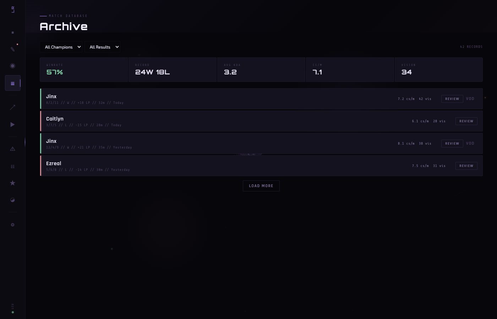

### Trends
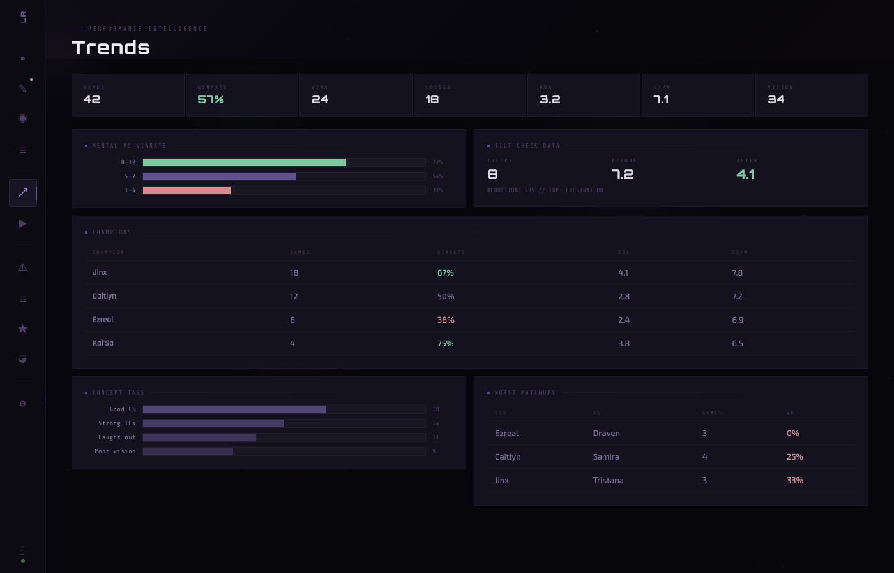

### VOD Player
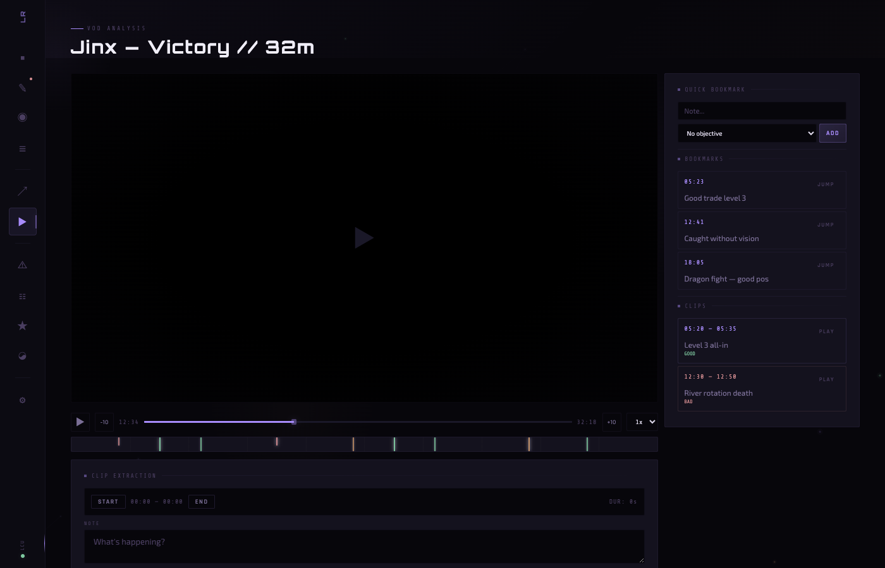

### Rules
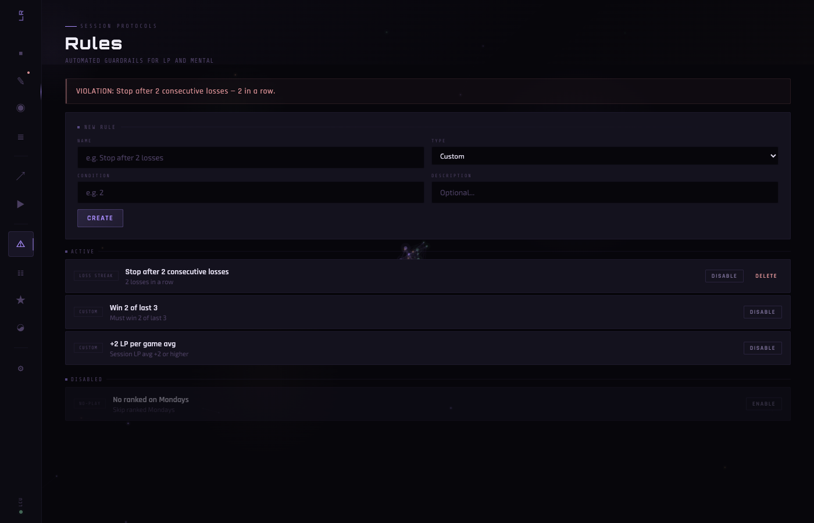

### Session Log
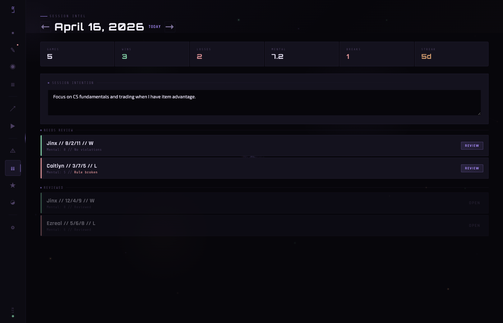

### Pre-Game
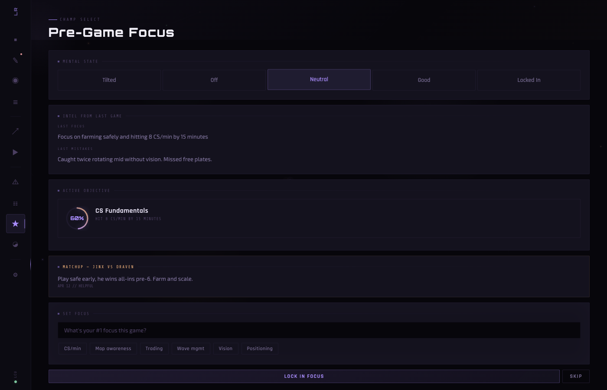

### Tilt Check
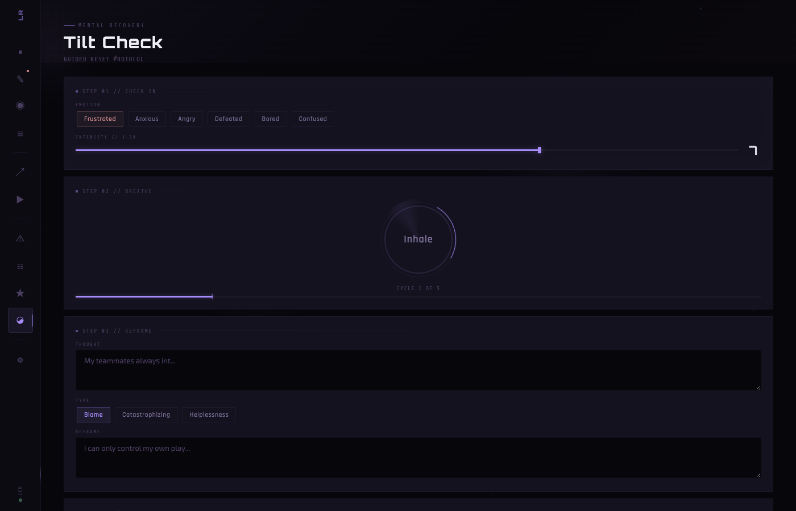

### Settings
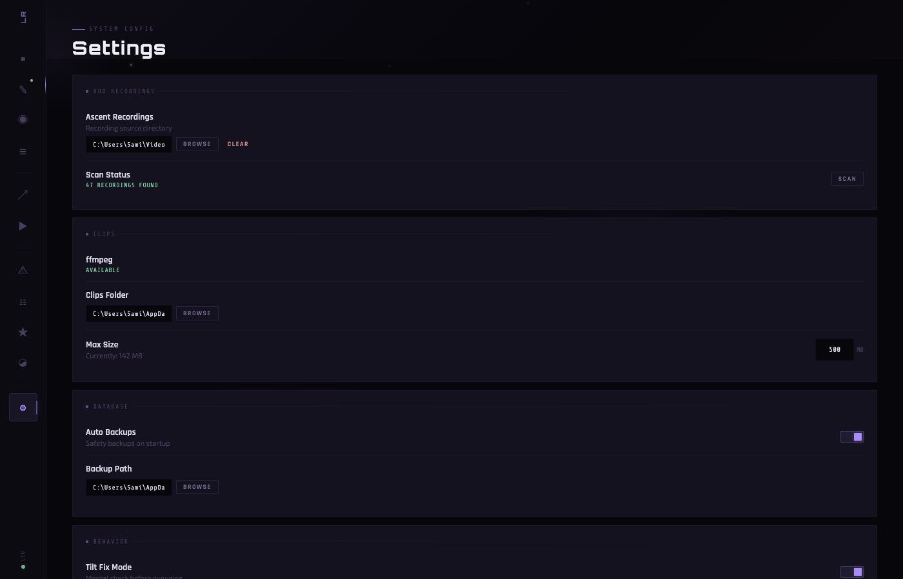


## TL;DR of What's Needed

The theme (colors, fonts, 2px corners) is done. What's NOT done is the structural layout work:

1. **Custom controls** need to be built (`ProgressRing`, `StatStrip`, `GameRowCard`, `CornerBracketedCard`)
2. **Page layouts** need to be rebuilt against the mockup (Dashboard, Review, VOD, Objectives)
3. **Composition animations** need to be wired up (breathing glows, hover effects, data streams)

This is real implementation work — roughly 3-5 days of focused XAML + Composition API work.

## Opening Next Session

Use this prompt to get going fast:

> I'm on the LoL Review WinUI 3 app. Read `docs/UI_REDESIGN_HANDOFF.md` and open `mockups/app-mockup.html` in a browser to see the target design. The theme (colors, fonts) is already applied — I need help closing the layout gap. Let's start with [Phase 6A: custom controls / Phase 6B: Dashboard rebuild / specific item].

---

## What Already Shipped (Phase 1-5)

Foundation work — do NOT redo:
- Theme palette in `Themes/AppTheme.xaml` (violet `#A78BFA` + bronze `#C9956A`)
- Fonts bundled in `Assets/Fonts/` and registered as `DisplayFont` / `HeadingFont` / `HeadingBoldFont` / `MonoFont` / `BodyFont` resources
- All 2px border-radius
- Sidebar collapsed to 72px icon rail with tooltips (`ShellPage.xaml`)
- All hardcoded color references across 15+ .cs files
- Font refs updated where needed

Current state: looks themed, but layouts don't match the mockup.

---

## Phase 6A — Custom Controls (Build First)

Build these as `UserControl`s in `src/LoLReview.App/Controls/`. Reuse across pages.

### 1. ProgressRing
Replaces the flat `ObjectiveProgressBar` for objectives. Violet gradient stroke with breathing drop-shadow.

**File:** `Controls/ProgressRing.xaml` + `.xaml.cs`

```xml
<UserControl ...>
  <Grid Width="56" Height="56">
    <Ellipse Width="50" Height="50"
             Stroke="{ThemeResource AccentBlueDimBrush}"
             StrokeThickness="3"/>
    <Path x:Name="ArcPath"
          Stroke="{ThemeResource AccentBlueBrush}"
          StrokeThickness="3"
          StrokeStartLineCap="Round"
          StrokeEndLineCap="Round"/>
    <TextBlock x:Name="LabelText"
               FontFamily="{StaticResource DisplayFont}"
               FontSize="11"
               FontWeight="Bold"
               Foreground="{ThemeResource AccentBlueBrush}"
               HorizontalAlignment="Center"
               VerticalAlignment="Center"/>
  </Grid>
</UserControl>
```

Code-behind math to build arc geometry:
```csharp
// Given Progress (0-1), build a Path for the arc portion
var angle = Progress * 360.0;
var radians = (angle - 90) * Math.PI / 180.0;
var endX = 28 + 25 * Math.Cos(radians);
var endY = 28 + 25 * Math.Sin(radians);
var isLargeArc = angle > 180;
var pathGeometry = new PathGeometry();
var figure = new PathFigure { StartPoint = new Point(28, 3) };
figure.Segments.Add(new ArcSegment {
    Point = new Point(endX, endY),
    Size = new Size(25, 25),
    IsLargeArc = isLargeArc,
    SweepDirection = SweepDirection.Clockwise
});
pathGeometry.Figures.Add(figure);
ArcPath.Data = pathGeometry;
```

Add breathing glow:
```csharp
var visual = ElementCompositionPreview.GetElementVisual(ArcPath);
var compositor = visual.Compositor;
var shadow = compositor.CreateDropShadow();
shadow.Color = Color.FromArgb(120, 167, 139, 250);
shadow.BlurRadius = 10;
// Animate BlurRadius from 4 to 14 over 3s, infinite
var anim = compositor.CreateScalarKeyFrameAnimation();
anim.InsertKeyFrame(0, 4);
anim.InsertKeyFrame(0.5f, 14);
anim.InsertKeyFrame(1, 4);
anim.Duration = TimeSpan.FromSeconds(3);
anim.IterationBehavior = AnimationIterationBehavior.Forever;
shadow.StartAnimation(nameof(shadow.BlurRadius), anim);
```

**Dependency properties:** `Progress` (double), `Label` (string), `AccentBrush` (Brush).

### 2. StatStrip / StatCell
A horizontal connected strip of stats. No gaps between cells.

**File:** `Controls/StatStrip.xaml` (container) + `Controls/StatCell.xaml` (individual cell).

Use a `Grid` with `ColumnSpacing="0"`. Each cell is a Border with merged borders via `BorderThickness`:
- First cell: `BorderThickness="1,1,0,1"` `CornerRadius="2,0,0,2"`
- Middle cells: `BorderThickness="1,1,0,1"` `CornerRadius="0"`
- Last cell: `BorderThickness="1"` `CornerRadius="0,2,2,0"`

Cell content:
```xml
<StackPanel Spacing="4" Padding="16,14">
  <TextBlock Text="{x:Bind Label}" Style="{StaticResource StatLabelStyle}"/>
  <TextBlock Text="{x:Bind Value}" Style="{StaticResource StatValueStyle}"
             Foreground="{x:Bind ValueBrush}"/>
  <TextBlock Text="{x:Bind Sub}" FontFamily="{StaticResource MonoFont}"
             FontSize="9" Foreground="{ThemeResource MutedTextBrush}"
             Visibility="{x:Bind HasSub}"/>
</StackPanel>
```

### 3. CornerBracketedCard
A `Border`-based card that shows 4 targeting-reticle corner brackets on hover.

**File:** `Controls/CornerBracketedCard.xaml`

```xml
<Grid>
  <Border x:Name="MainBorder"
          Background="{ThemeResource CardBackgroundBrush}"
          BorderBrush="{ThemeResource SubtleBorderBrush}"
          BorderThickness="1"
          CornerRadius="2"
          Padding="20">
    <ContentPresenter/>
  </Border>
  <!-- 4 corner brackets, hidden by default -->
  <Border x:Name="TopLeft" Width="10" Height="10"
          HorizontalAlignment="Left" VerticalAlignment="Top"
          Margin="-1"
          BorderBrush="{ThemeResource BrightBorderBrush}"
          BorderThickness="1,1,0,0"
          Opacity="0"/>
  <!-- ...3 more corners... -->
</Grid>
```

In code-behind, on `PointerEntered` fade corners to opacity 1, on `PointerExited` fade to 0. Use Storyboard or Composition.

### 4. GameRowCard
Game row with glowing win/loss bar, slide-right on hover, gradient trail sweep.

**File:** `Controls/GameRowCard.xaml` (already exists — may just need updates)

Key styling:
- Left `Rectangle` 3px wide, color-bound, with `DropShadow` for glow
- Whole card `TranslateTransform` on hover (use `PointerEntered`)
- Internal `Rectangle` filled with `LinearGradientBrush(90deg, accent@0.06, transparent)` — animate its width 0→100% on hover

### 5. HeroHeader
Page-level hero zone with gradient wash, blinking cursor, DisplayFont title.

**File:** `Controls/HeroHeader.xaml`

Properties: `EyebrowText`, `Title`, `Subtitle`.

Structure:
```xml
<Grid Padding="40,30,40,16">
  <Rectangle HorizontalAlignment="Stretch" Height="200"
             VerticalAlignment="Top" Opacity="0.04">
    <Rectangle.Fill>
      <LinearGradientBrush StartPoint="0,0" EndPoint="1,1">
        <GradientStop Color="#A78BFA" Offset="0"/>
        <GradientStop Color="#C9956A" Offset="1"/>
      </LinearGradientBrush>
    </Rectangle.Fill>
  </Rectangle>
  <StackPanel>
    <StackPanel Orientation="Horizontal" Spacing="8">
      <Rectangle Width="20" Height="1" Fill="{ThemeResource AccentBlueBrush}"
                 VerticalAlignment="Center"/>
      <TextBlock Text="{x:Bind EyebrowText}" Style="{StaticResource PanelEyebrowStyle}"
                 Foreground="{ThemeResource AccentBlueBrush}"/>
      <TextBlock Text="_" FontFamily="{StaticResource MonoFont}"
                 Foreground="{ThemeResource AccentBlueBrush}">
        <TextBlock.OpacityTransition>
          <ScalarTransition Duration="0:0:0.5"/>
        </TextBlock.OpacityTransition>
      </TextBlock>
    </StackPanel>
    <TextBlock Text="{x:Bind Title}" Style="{StaticResource HeroTitleStyle}"
               Margin="0,4,0,0"/>
  </StackPanel>
</Grid>
```

Cursor blink: toggle opacity via DispatcherTimer every 500ms.

### 6. SectionTitle
`// SECTION TITLE ═══════════════` — monospace label with pulsing dot + extending line.

```xml
<StackPanel Orientation="Horizontal" Spacing="8">
  <Rectangle Width="4" Height="4" Fill="{ThemeResource AccentBlueBrush}"
             VerticalAlignment="Center"/>
  <TextBlock Text="{x:Bind Text}" Style="{StaticResource PanelEyebrowStyle}"/>
  <Rectangle Height="1" Fill="{ThemeResource SubtleBorderBrush}"
             HorizontalAlignment="Stretch" VerticalAlignment="Center"
             Width="Auto"/>
</StackPanel>
```

Wrap in a `Grid` with `ColumnDefinitions Auto,Auto,*` so the line extends.

### 7. BannerControl
Colored-left-bar banner (`banner-positive`, `banner-negative`, etc.).

Three properties: `Tone` (positive/negative/neutral), `Text`, `IconGlyph`. Border with `BorderThickness="0"` and a 2px `Rectangle` on left with pulsing opacity animation.

---

## Phase 6B — Rebuild Dashboard (Template for Others)

Use this as the proof point. Once Dashboard matches mockup, use the same patterns on other pages.

### Target Structure (match `mockups/app-mockup.html` `#p-dash`):

```xml
<Grid>
  <Grid.RowDefinitions>
    <RowDefinition Height="Auto"/> <!-- HeroHeader -->
    <RowDefinition Height="*"/>    <!-- Content -->
  </Grid.RowDefinitions>

  <controls:HeroHeader Grid.Row="0"
    EyebrowText="COMMAND CENTER"
    Title="{x:Bind ViewModel.Greeting}"/>

  <ScrollViewer Grid.Row="1" Padding="40,0,40,40">
    <StackPanel Spacing="16">
      <!-- Session banner -->
      <controls:BannerControl Tone="Positive"
        Text="{x:Bind ViewModel.SessionBannerText}"
        Visibility="{x:Bind ViewModel.ShowSessionBanner, ...}"/>

      <!-- Stat strip -->
      <controls:StatStrip>
        <controls:StatCell Label="GAMES" Value="{x:Bind ViewModel.TotalGames}"/>
        <controls:StatCell Label="WIN RATE" Value="{x:Bind ViewModel.Winrate}"
                           ValueBrush="{ThemeResource WinGreenBrush}"
                           Sub="{x:Bind ViewModel.RecordText}"/>
        <controls:StatCell Label="AVG MENTAL" Value="{x:Bind ViewModel.AvgMental}"/>
        <controls:StatCell Label="ADHERENCE" Value="{x:Bind ViewModel.AdherenceStreak}"
                           ValueBrush="{ThemeResource AccentGoldBrush}"
                           Sub="STREAK ACTIVE"/>
      </controls:StatStrip>

      <!-- Two-column body -->
      <Grid ColumnSpacing="14">
        <Grid.ColumnDefinitions>
          <ColumnDefinition Width="2*"/>
          <ColumnDefinition Width="*"/>
        </Grid.ColumnDefinitions>

        <controls:CornerBracketedCard Grid.Column="0">
          <StackPanel Spacing="8">
            <controls:SectionTitle Text="UNREVIEWED"/>
            <ItemsRepeater ItemsSource="{x:Bind ViewModel.Unreviewed, ...}">
              <ItemsRepeater.ItemTemplate>
                <DataTemplate>
                  <controls:GameRowCard .../>
                </DataTemplate>
              </ItemsRepeater.ItemTemplate>
            </ItemsRepeater>
          </StackPanel>
        </controls:CornerBracketedCard>

        <StackPanel Grid.Column="1" Spacing="12">
          <controls:CornerBracketedCard>
            <StackPanel Spacing="10">
              <controls:SectionTitle Text="ACTIVE OBJECTIVES"/>
              <ItemsRepeater ItemsSource="{x:Bind ViewModel.ActiveObjectives, ...}">
                <ItemsRepeater.ItemTemplate>
                  <DataTemplate>
                    <Grid ColumnSpacing="14" Margin="0,0,0,10">
                      <Grid.ColumnDefinitions>
                        <ColumnDefinition Width="Auto"/>
                        <ColumnDefinition Width="*"/>
                      </Grid.ColumnDefinitions>
                      <controls:ProgressRing Progress="{Binding Progress}"
                                             Label="{Binding ProgressLabel}"/>
                      <StackPanel Grid.Column="1">
                        <TextBlock Text="{Binding Title}"
                                   FontFamily="{StaticResource HeadingFont}"
                                   FontSize="15" FontWeight="SemiBold"/>
                        <TextBlock Text="{Binding MetaText}"
                                   FontFamily="{StaticResource MonoFont}"
                                   FontSize="9"
                                   Foreground="{ThemeResource MutedTextBrush}"/>
                      </StackPanel>
                    </Grid>
                  </DataTemplate>
                </ItemsRepeater.ItemTemplate>
              </ItemsRepeater>
            </StackPanel>
          </controls:CornerBracketedCard>

          <!-- Last Focus - bronze-tinted -->
          <controls:CornerBracketedCard BorderBrush="{ThemeResource AccentGoldBrush}">
            <StackPanel Spacing="6">
              <controls:SectionTitle Text="LAST FOCUS"/>
              <TextBlock Text="{x:Bind ViewModel.LastFocusText}"/>
            </StackPanel>
          </controls:CornerBracketedCard>
        </StackPanel>
      </Grid>
    </StackPanel>
  </ScrollViewer>
</Grid>
```

### Binding changes needed on DashboardViewModel
- Add `ProgressLabel` (e.g. "60%") and `MetaText` (e.g. "LVL 2 // DRILLING // 12/20 PTS") to objective items if not present
- Preserve all existing bindings (Review/Hide commands, etc.)

---

## Phase 6C — Page-by-Page Checklist

### Review Page
- [ ] Replace `ScrollViewer` + `StackPanel` wrap with `Grid` + `HeroHeader` pattern
- [ ] "Watch VOD" button: add breathing `DropShadow` animation on Composition
- [ ] Objective practice cards: use `CornerBracketedCard` with `ProgressRing`
- [ ] Concept tags: use `WrapPanel` (not `StackPanel`) for fluid layout
- [ ] Right column VOD bookmarks: sticky via fixed-width column outside main ScrollViewer

### VOD Player Page
- [ ] Check bookmarks panel is truly sticky (scrolls independently of video)
- [ ] Timeline: add pulsing markers (opacity animation)
- [ ] Add playhead indicator on timeline (vertical line at current time)
- [ ] Clip quality pills: use `controls:Pill` style if created

### Objectives Page
- [ ] Each objective card uses `ProgressRing` instead of flat bar
- [ ] Sparkline bars: add staggered grow animation (already exists but needs enter animation)
- [ ] "Spotted Problems" section uses `GameRowCard` style

### Archive Page (History)
- [ ] Filter bar: add animated underline on active filter
- [ ] `GameRowCard` for each row with slide-right hover
- [ ] Stat strip at top using `StatStrip` control

### Trends Page (Analytics)
- [ ] Stat strip at top (7 cells)
- [ ] Bar chart rows: staggered grow-in animation on page load
- [ ] Tables: hover gradient sweep (via `VisualStateManager`)

### Rules Page
- [ ] Violation banner: `BannerControl Tone="Negative"` with electric crackle effect (opacity flicker on multiple radial gradients)
- [ ] Rule cards: `CornerBracketedCard` pattern

### Session Log, Pre-Game, Tilt Check, Settings
- [ ] Apply `HeroHeader` + `SectionTitle` pattern
- [ ] Replace generic Borders with `CornerBracketedCard`
- [ ] Tilt Check breath circle already has animation — just verify it renders
- [ ] Settings: same pattern, folder rows look fine

---

## Phase 6D — Composition Animations

Build a helper class: `Helpers/AnimationHelper.cs`

Key methods to implement:

```csharp
public static class AnimationHelper
{
  // Attach to Border/Grid — adds breathing drop-shadow
  public static void AttachBreathingGlow(UIElement element, Color glowColor,
    float minBlur = 4, float maxBlur = 14, double durationSec = 3) { ... }

  // Attach to Button — light sweep left-to-right on hover
  public static void AttachHoverLightSweep(Button btn) { ... }

  // Attach to Border — slide-right + gradient trail on hover
  public static void AttachSlideHover(Border row) { ... }

  // Corner brackets fade-in on hover
  public static void AttachCornerBrackets(CornerBracketedCard card) { ... }

  // Pulsing opacity loop (status dots, selected pills)
  public static void AttachPulseOpacity(UIElement element,
    double minOpacity = 0.4, double maxOpacity = 1, double durationSec = 2) { ... }

  // Sidebar data stream
  public static void StartDataStream(Rectangle streamRect, double durationSec = 3) { ... }

  // Page entrance transition
  public static void AnimatePageEnter(UIElement root) { ... }
}
```

Most use `Compositor.CreateScalarKeyFrameAnimation()` with `IterationBehavior.Forever`.

### Page entrance specifically
Apply on `Page.Loaded`:
```csharp
var visual = ElementCompositionPreview.GetElementVisual(this);
visual.Opacity = 0;
visual.Offset = new Vector3(0, 16, 0);

var batch = visual.Compositor.CreateScopedBatch(CompositionBatchTypes.Animation);
var opacityAnim = visual.Compositor.CreateScalarKeyFrameAnimation();
opacityAnim.InsertKeyFrame(0, 0);
opacityAnim.InsertKeyFrame(1, 1);
opacityAnim.Duration = TimeSpan.FromMilliseconds(500);
visual.StartAnimation("Opacity", opacityAnim);

var offsetAnim = visual.Compositor.CreateVector3KeyFrameAnimation();
offsetAnim.InsertKeyFrame(0, new Vector3(0, 16, 0));
offsetAnim.InsertKeyFrame(1, Vector3.Zero);
offsetAnim.Duration = TimeSpan.FromMilliseconds(500);
visual.StartAnimation("Offset", offsetAnim);
batch.End();
```

---

## Phase 6E — Ambient Effects (Optional, Defer If Needed)

### Sidebar data stream
Add to `ShellPage.xaml.cs` `OnLoaded`:
```csharp
var streamRect = new Rectangle { Width = 1, Height = 30,
  Fill = GetStreamGradient(), Opacity = 0.8 };
// Position absolutely on sidebar right edge
// Animate TranslationY from -30 to ActualHeight continuously
```

### Ambient orbs
Three large `Ellipse` elements with `RadialGradientBrush`, `Canvas` positioned,
slow `TranslateTransform` animations via `Storyboard`.

### Cursor glow follower
```csharp
// In ShellPage OnLoaded
var cursorGlow = new Ellipse { Width = 180, Height = 180,
  Fill = GetRadialGradient(), IsHitTestVisible = false };
MainGrid.Children.Add(cursorGlow);

PointerMoved += (s, e) => {
  var pos = e.GetCurrentPoint(this).Position;
  Canvas.SetLeft(cursorGlow, pos.X - 90);
  Canvas.SetTop(cursorGlow, pos.Y - 90);
};
```

### Particles + 3D tilt
Skip unless you want to add Win2D. Not worth the NuGet interop risk for alpha.

---

## Known Risks

### Font loading
Unpackaged WinUI 3 has finicky `ms-appx:///` URI resolution. If all text looks like Segoe UI:
- Check diagnostic logs in `%LOCALAPPDATA%\LoLReviewData\`
- Verify `Assets\Fonts\*.ttf` copied to output directory
- The `.csproj` has `<Content Include="Assets\Fonts\*.ttf" CopyToOutputDirectory="PreserveNewest" />`
- Fallback: install fonts system-wide on Windows and reference by family name only (e.g. `FontFamily="Orbitron"`)

### WinUIThemeStubs.xaml
244KB file with hand-extracted WinUI system resources (workaround for unpackaged apps). Many built-in control states (ComboBox, Slider, ToggleButton, CheckBox, RadioButton) still reference jade colors. Should be audited after Phase 6.

### Composition animations lifecycle
Starting animations in `OnLoaded` but element may be re-loaded (navigation away/back). Either:
- Stop animations in `OnUnloaded`
- Attach animations via dependency properties / attached properties that handle lifecycle

---

## Key Files Reference

| File | Purpose |
|------|---------|
| `src/LoLReview.App/Themes/AppTheme.xaml` | Palette + styles (done) |
| `src/LoLReview.App/Views/ShellPage.xaml` | Sidebar + frame (done) |
| `src/LoLReview.App/Views/DashboardPage.xaml` | Rebuild target #1 |
| `src/LoLReview.App/Views/ReviewPage.xaml` | Rebuild target #2 |
| `src/LoLReview.App/Views/VodPlayerPage.xaml` | Rebuild target #3 |
| `src/LoLReview.App/Controls/` | Build new custom controls here |
| `src/LoLReview.App/Helpers/` | Put `AnimationHelper.cs` here |
| `mockups/app-mockup.html` | **Design truth — keep open in browser** |

---

## Build & Run (reminder)

```powershell
dotnet restore src\LoLReview.App\LoLReview.App.csproj -r win-x64
msbuild LoLReview.sln /p:Configuration=Debug /p:Platform=x64 /p:RuntimeIdentifier=win-x64
.\run.bat
```

---

## Outstanding Non-UI Work

- **Bug backlog** — user mentioned bugs before alpha but hasn't triaged them yet. Raise this in next session.
- **Phase 7 (optional):** Win2D particles, 3D magnetic tilt, cursor glow follower. Skip unless alpha feedback demands them.

---

## Suggested Execution Order for Next Session

1. Open `mockups/app-mockup.html` in a browser, keep it visible
2. Build Phase 6A custom controls (ProgressRing, StatStrip, CornerBracketedCard, HeroHeader, SectionTitle, BannerControl, GameRowCard updates)
3. Rebuild Dashboard (Phase 6B) using only those custom controls
4. Verify it matches the mockup closely — if not, iterate
5. Use Dashboard as template for Review, VOD, Objectives (Phase 6C)
6. Sweep remaining pages with `HeroHeader` + `CornerBracketedCard`
7. Add Phase 6D animations (AnimationHelper)
8. Optional: Phase 6E ambient effects
